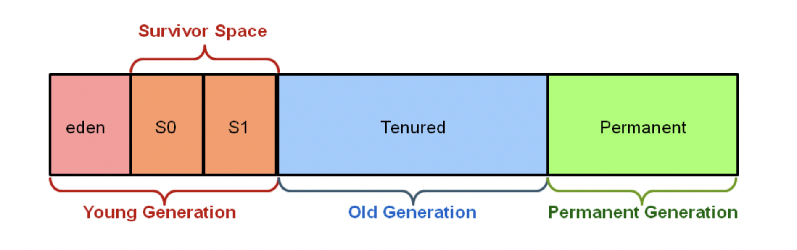

# **JVM**

* [JDK](#jdk)
* [JRE](#jre)
* [JVM](#jvm)
* [Устройство памяти в java]()
* [Garbage collector](#garbage-collector)
* [Виды GC](#Виды-GC)

## JDK
**JDK (Java Development Kit)** - комплект разработчика приложений на языке Java,
включающий в себя компилятор, стандартные библиотеки классов Java, примеры,
документацию, различные утилиты и исполнительную систему JRE.

## JRE
**JRE (Java Runtime Environment)** - минимальная реализация виртуальной машины,
необходимая для исполнения Java приложений, без компилятора и других средств разработки.
Состоит из виртуальной машины и библиотек Java классов.

## JVM
**JVM (Java Virtual Machine)** - виртуальная машина Java - основная часть исполняющей системы
Java, так называемой Java Runtime Environment (JRE).
Виртуальная машина Java исполняет байт-код Java,
предварительно созданный из исходного текста Java-программы компилятором Java (javac).
JVM обеспечивает платформо-независимый способ выполнения кода.
Программисты могут писать код не задумываясь, как и где он будет выполняться.

Отвечает за:
* Загрузку, проверку и исполнение байт кода;
* Предоставление среды выполнения для выполнения байт-кода;
* Управление памятью и очисткой мусора (Garbage collection);

## Устройство памяти в java

**Heap** - куча. Основной сегмент памяти, где содержатся все объекты и происходит 
сборка мусора.

Пространство Эдема — все новые объекты начинают здесь, 
и им выделяется начальная память.

Пространства выживших (S0 S1) — объекты перемещаются сюда из Эдема после того, 
как пережили один цикл сборки мусора.
Перемещение объектов между двумя пространствами, нужно для того что бы не приходилось
фрагментировать область памяти с оставшимися живыми объектами. Плюс, при переносе можно
сразу проверить является ли объект живым.

Пример:
* В Эдеме есть объекты обоих типов (живые и мертвые).
* Происходит малая GC — все мертвые объекты удаляются из Эдема.
Все живые объекты перемещаются в пространство S0. Эдем и пространство S1 теперь пусты.
* Новые объекты создаются и добавляются в Эдем. 
Некоторые объекты в Эдеме и пространстве S0 становятся мертвыми.
* Происходит малая GC — все мертвые объекты удаляются из Эдема и пространства S1.
Все живые объекты перемещаются в пространство S1. Эдем и пространство S0 снова пусты.

Когда выжившие объекты достигают определенного порога перемещения по пространствам 
выживших, они переходят в старшее поколение (Old generation).

Пороговое значение срока службы объекта определяет, сколько циклов сборки мусора он может пережить, прежде чем будет перемещен в старшее поколение.

Процесс, когда объекты отправляются в мусор из старшего поколения, называется основным событием сборки мусора.

**Permanent Generation** - содержит мета-данные классов.

## Garbage collector
Сборщик мусора **Garbage Collector** выполняет две задачи, связанные с поиском мусора 
и его очисткой. Для обнаружения мусора существует два подхода:

**Reference counting** - у каждого объекта счетчик ссылок. 
Когда он равен нулю, объект считается мусором. Проблема такого подхода в том, 
что могут быть цикличные ссылки у объектов друг на друга, в то время как они фактически мусор
и не используются программой.

**Tracing** - объект считается не мусором, если до него можно добраться с корневых точек

Типы DG root:
* Основной Java поток
* Локальные переменные в основном методе
* Статические переменные основного класса

## Виды GC
### Serial garbage collector
Все события сборки мусора выполняются последовательно в одном потоке. 
Уплотнение выполняется после каждой сборки мусора.

Запуск сборщика приводит к приостановке работы приложения.

### Parallel garbage collector
Параллельный сборщик мусора предназначен для приложений со средними и большими наборами 
данных, которые выполняются на многопроцессорном или многопоточном оборудовании. 
Это реализация GC по умолчанию.

Несколько потоков предназначаются для малой сборки мусора в молодом поколении. 
Единственный поток занят основной сборкой мусора в старшем поколении.

Запуск параллельного GC также приводит к приостановке приложения. 
Такое больше подходит для многопоточной среды, 
когда требуется завершить много задач и допустимы длительные паузы.

### G1
Физически область Heap делится на регионы одинакового размера, каждый из которых может 
быть Eden, Survivor или Old Generation + область для больших объектов.

Над очисткой регионов Eden работает сразу несколько потоков, объекты переносятся в регионы 
Survivor или регионы старшего поколения (Tenured). На время очистки работа приложения 
останавливается.

После окончания цикла пометки G1 переключается на выполнение смешанных сборок. 
Это значит, что при каждой сборке к набору регионов младшего поколения, подлежащих очистке,
добавляется некоторое количество регионов старшего поколения. 
Количество таких сборок и количество очищаемых регионов старшего поколения 
выбирается исходя из имеющейся у сборщика статистики о предыдущих сборках таким образом, 
чтобы не выходить за требуемое время сборки. Как только сборщик очистил достаточно памяти,
он переключается обратно в режим малых сборок.