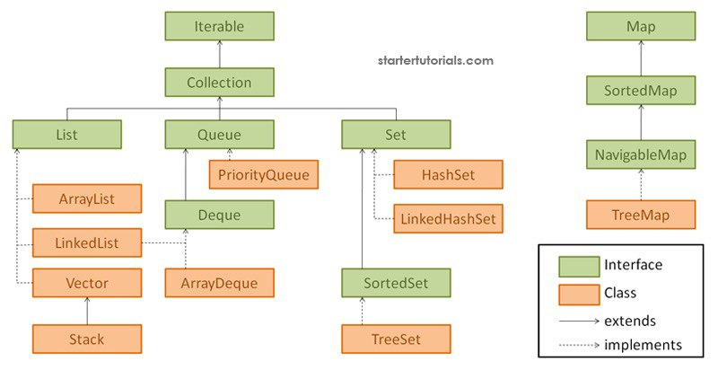

# **Java Collections**

* Что такое коллекция?
* Иерархия коллекций
* Контракт equals() hashCode()
* Интерфейс Comparator
* Интерфейс Comparable
* В чём разница между Iterable и Iterator?

## Что такое коллекция
«Коллекция» - это структура данных, набор каких-либо объектов. 
Данными (объектами в наборе) могут быть числа, строки, 
объекты пользовательских классов и т.п.

## Иерархия коллекций

**List** (список) представляет собой коллекцию, в которой допустимы дублирующие значения.

Интерфейс **Collection** расширяют интерфейсы:

* **List** (список) представляет собой коллекцию, в которой допустимы дублирующие 
значения. Реализации:
  * **ArrayList** - инкапсулирует в себе обычный массив, длина которого автоматически
  увеличивается при добавлении новых элементов. Элементы такой коллекции пронумерованы,
  начиная от нуля, к ним можно обратиться по индексу.
  * **LinkedList** (двунаправленный связный список) - состоит из узлов, каждый из которых
  содержит как собственно данные, так и две ссылки на следующий и предыдущий узел.
  * **Vector** - **deprecated**
  * **Stack** LIFO
* **Set** (сет) описывает неупорядоченную коллекцию, не содержащую повторяющихся элементов. Реализации:
  * **HashSet** - использует HashMap для хранения данных. В качестве ключа и значения используется добавляемый элемент. 
  Из-за особенностей реализации порядок элементов не гарантируется при добавлении.
  * **LinkedHashSet** — гарантирует, что порядок элементов при обходе коллекции 
  будет идентичен порядку добавления элементов.
  * **TreeSet** — предоставляет возможность управлять порядком элементов в коллекции при помощи объекта 
  Comparator, либо сохраняет элементы с использованием «natural ordering».
* **Queue** (очередь) предназначена для хранения элементов с предопределённым 
способом вставки и извлечения FIFO (first-in-first-out):
  * LinkedList - FIFO

Интерфейс **Map** реализован классами:
* **HashMap** — хэш-таблица. Позволяет использовать null в качестве значения или ключа 
и не является упорядоченной.
* **LinkedHashMap** — упорядоченная реализация хэш-таблицы.
* **TreeMap** - хранит упорядоченные элементы по ключу. 

## Контракт equals() hashCode()
1. При переопределении hashCode нужно переопределять и equals (и наоборот).
2. Если два объекта равны по equals, то равны и по hashCode.
3. Если равны по hashCode, то могут быть разными по equals.

## Интерфейс Comparator
```java
public class Example {

    public static void main(String[] args) {
        List<String> strings = new ArrayList<>();

        strings.add("sss");
        strings.add("s");
        strings.add("ss");
        strings.add("sssssss");

        strings.sort(new Comparator<String>() {
            @Override
            public int compare(String o1, String o2) {
                return Integer.compare(o1.length(), o2.length());
            }
        });
    }
}
```

## Интерфейс Comparable
Интерфейс Comparable содержит один единственный метод int compareTo(E item), 
который сравнивает текущий объект с объектом, переданным в качестве параметра.
```javas
class Item implements Comparable<Item> {
    private Integer id;

    public Integer getId() {
        return id;
    }

    @Override
    public int compareTo(Item o) {
        return Integer.compare(this.getId(), o.getId());
    }
}
```

## В чём разница между Iterable и Iterator?
Интерфейс iterator отвечает за реализацию методов hasNext() и next() для перебора коллекции.

Интерфейс iterable заставляет его подклассы реализовывать метод "iterator()" и позволяет 
объекту быть использованным в цикле foreach