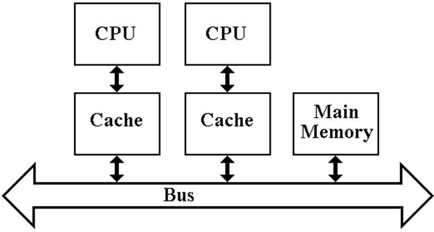

# **Java Multithreading**

- [Отличие Thread от Runnable](#отличие-thread-от-runnable)
- [Поток-демон](#поток-демон)
- [Ключевое слово volatile (когерентность кэша)](#ключевое-слово-volatile)
- [Ключевое слово synchronized](#ключевое-слово-synchronized)
- [wait, notify](#wait-notify)
- [Паттерн Consumer Producer](#паттерн-consumer-producer)
- [Прерывание потоков](#прерывание-потоков)
- [Callable и Future](#callable-и-future)
- [Thread pool](#thread-pool)
- [ReentrantLock](#reentrantlock)
- [ArrayBlockingQueue](#arrayblockingqueue)

## Отличие Thread от Runnable
```java
class MyThread extends Thread {
    
    @Override
    public void run() {
        for (int i = 0; i <= 10; i++) {
            System.out.println(i);
        }
    }
}
```

```java
class MyRunner implements Runnable {

    @Override
    public void run() {
        for (int i = 0; i <= 10; i++) {
            System.out.println(i);
        }
    }
}
```
```Thread``` - это абстракция над физическим потоком.

```Runnable``` - это абстракция над выполняемой задачей.

Плюс использования ```Runnable``` состоит в том, что это позволяет логически 
отделить выполнение задачи от логики управления потоками.

## Поток-демон

Потоками-демонами называются потоки, работающие в фоновом режиме для нашей программы.

В Java процесс завершается тогда, когда завершается последний его поток. 
Даже если метод main() уже завершился, но еще выполняются порожденные им потоки, система будет ждать их завершения.
Однако это правило не относится к особому виду потоков – демонам. 
Если завершился последний обычный поток процесса, и остались только потоки-демоны, то они будут принудительно завершены и выполнение процесса закончится. 

Чаще всего потоки-демоны используются для выполнения фоновых задач, обслуживающих процесс в течение его жизни.

```thread.setDaemon(true);``` - пометить поток как демон

```java
public class DaemonExample {
    public static void main(String[] args) throws InterruptedException {
        runDaemon();
        runNotDaemon();
        System.out.println("Main is DONE!");
    }

    private static void runNotDaemon() {
        var thread = new Thread(() -> {
            try {
                Thread.sleep(4000);
            } catch (InterruptedException e) {
                throw new RuntimeException(e);
            }

            System.out.println("NOT Daemon done");
        });
        thread.start();
    }

    /**
     * Если завершился последний обычный поток процесса, и остались только потоки-демоны,
     * то они будут принудительно завершены и выполнение процесса закончится
     */
    private static void runDaemon() {
        var thread = new Thread(() -> {
            try {
                Thread.sleep(2000);
            } catch (InterruptedException e) {
                throw new RuntimeException(e);
            }
            System.out.println("Daemon is done!");
        });
        thread.setDaemon(true);
        thread.start();
    }
}
```

## Ключевое слово volatile
```volatile``` - используется когда один поток пишет в переменную, а все остальные потоки
читают эту переменную. Позволяет не кэшировать переменную в кэше ядра(когерентность кэша).



Потоки могут распределиться по разным ядрам процессора и закэшировать значение переменной,
значение которой может поменяться. Вследствие чего, у потоков будет не актуальное значение
это переменной.

## Ключевое слово synchronized
```synchronized``` - работает таким образом, что только один поток в момент времени может
получить доступ к выполнению тела метода.
```java
public synchronized void execute() {
    /*...*/
}
```

```java
public void execute() {
    synchronized (this) {
        /*...*/
    }
}
```

## wait, notify
```wait()``` - освобождает монитор и переводит вызывающий поток в состояние ожидания до тех пор,
пока другой поток не вызовет метод notify().

```notify()``` - продолжает работу потока, у которого ранее был вызван метод wait().

Пример:
```java
class Worker {
    public void produce() throws InterruptedException {
        synchronized (this) {
            System.out.println("Start produce...");
            this.wait();
            System.out.println("Finish produce...");
        }
    }

    public void consume() throws InterruptedException {
        synchronized (this) {
            System.out.println("Start consume...");
            Thread.sleep(2000);
            System.out.println("Notify...");
            this.notify();
        }
    }
}
```

Output:
```
Start produce...
Start consume...
Notify...
Finish produce...
```

## Паттерн Consumer Producer
```java
class Worker {
    private final Queue<Integer> queue = new LinkedList<>();
    private final Integer MAX_QUEUE_SIZE = 10;


    public void produce() throws InterruptedException {
        int payload = 0;

        while (true) {
            synchronized (this) {
                if (queue.size() == MAX_QUEUE_SIZE) {
                    this.wait();
                }

                queue.offer(payload++);
                this.notify();
            }
        }
    }

    public void consume() throws InterruptedException {
        while (true) {
            synchronized (this) {
                if (queue.size() == 0) {
                    this.wait();
                }

                System.out.println("Poll a payload from queue: " + queue.poll() + ". Current size is: " + queue.size());
                this.notify();
            }

            Thread.sleep(1000);
        }
    }
}
```

## Прерывание потоков
Прерывания позволяют завершить один поток из другого.
```java
public class Example {
    public static void main(String[] args) throws InterruptedException {
        Thread thread = new Thread(() -> {
            while (true) {
                if (Thread.currentThread().isInterrupted()) {
                    break;
                }
            }
        });

        thread.start();
        Thread.sleep(1500);
        thread.interrupt();
        thread.join();
    }
}
```

## Callable и Future
Интерфейс ```Callable``` позволяет выбрасывать исключение и возвращать результат выполнения потока.
 ```Future``` используется для получения результата работы потока.

```java
public class Example {
    public static void main(String[] args) throws InterruptedException {
        ExecutorService executorService = Executors.newFixedThreadPool(1);

        Future<Integer> future = executorService.submit(new Callable<Integer>() {
            @Override
            public Integer call() throws Exception {
                Random random = new Random();

                int randomInt = random.nextInt();

                if (randomInt == 5) {
                    throw new Exception("Random number is 5");
                }

                return randomInt;
            }
        });

        executorService.shutdown();

        try {
            System.out.println(future.get());
        } catch (ExecutionException e) {
            throw new RuntimeException(e);
        }
    }
}
```

## Thread pool

**Thread pool** - пул потоков, позволяет выполнять задания в N потоках.
```java
public class Example {
    public static void main(String[] args) {
        ExecutorService executorService = Executors.newFixedThreadPool(4);

        for (int i = 0; i < 5; i++) {
            executorService.submit(new Task(i));
        }

        executorService.shutdown();
    }
}

class Task implements Runnable {
    private final int id;

    Task(int id) {
        this.id = id;
    }

    @Override
    public void run() {
        System.out.printf("The task with id %d executed \n", id);
    }
}
```

## ReentrantLock
```ReentrantLock``` - аналог synchronized.
```java
class Runner {
    private int i;

    Lock lock = new ReentrantLock();

    public void increase() {
        lock.lock();
        for (int i = 0; i < 10000; i++) {
            this.i++;
        }
        lock.unlock();
    }

    public void firstThread() {
        this.increase();
    }

    public void secondThread() {
        this.increase();
    }

    public int getI() {
        return i;
    }
}
```

Для того, что бы отпустить блок, метод ```unlock()``` нужно вызвать столько же раз, 
сколько вызвали ```lock()```.

```ReentrantLock``` можно использовать, когда в разных потоках, необходимо забирать
локи в разных порядках.


## ArrayBlockingQueue
```java
public class Test {
    private final static ArrayBlockingQueue<Integer> queue = new ArrayBlockingQueue<>(10);
    private final static Random random = new Random();

    public static void main(String[] args) throws InterruptedException {
        Thread producerThread = createProduceThread();
        Thread consumerThread = createConsumerThread();

        producerThread.start();
        consumerThread.start();

        producerThread.join();
        consumerThread.join();
    }

    public static void produce() throws InterruptedException {
        while (true) {
            int putInt = random.nextInt(100);
            queue.put(putInt);
            System.out.printf("Put in the queue message with payload: %s \n", putInt);
        }
    }

    public static void consume() throws InterruptedException {
        while (true) {
            int takedInt = queue.take();

            System.out.printf("Taked from the queue message with payload: %s \n", takedInt);
        }
    }

    public static Thread createProduceThread() {
        return
                new Thread(() -> {
                    try {
                        produce();
                    } catch (InterruptedException e) {
                        throw new RuntimeException(e);
                    }
                });
    }

    public static Thread createConsumerThread() {
        return
                new Thread(() -> {
                    try {
                        consume();
                    } catch (InterruptedException e) {
                        throw new RuntimeException(e);
                    }
                });
    }
}
```