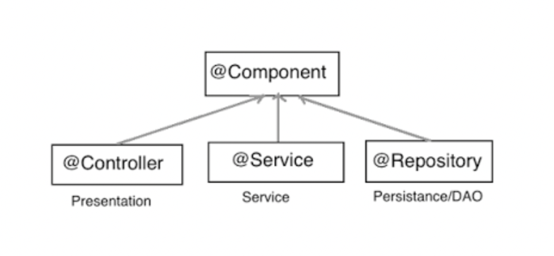

# **Spring**

* Spring beans dependency
* Spring context dependency
* DispatcherServlet
* Жизненный цикл beans
* Spring bean scope
* Spring Data
* Отличия компонентных аннотаций
* @Transactional
* JDBC API
* JDBC Template
* Spring Data JPA

## Spring beans dependency
Spring Beans предоставляет основные функции для создания экземпляров, настройки и 
сборки Java объектов.

## Spring context dependency
Spring Context это интерфейс, который предоставляет информацию о конфигурации приложения.

## DispatcherServlet
Вся логика работы Spring MVC построена вокруг DispatcherServlet, 
который принимает и обрабатывает все HTTP-запросы и ответы на них.

* После получения HTTP-запроса DispatcherServlet обращается к интерфейсу HandlerMapping, 
который определяет, какой Контроллер должен быть вызван,
после чего, отправляет запрос в нужный контроллер.
* Контроллер принимает запрос и вызывает соответствующий метод, который вернет view 
c данными в модели (model.addAttribute()).
* При помощи интерфейса ViewResolver DispatcherServlet определяет,
какой Вид нужно использовать на основании полученного имени.
* После того как view создан, DispatcherServlet отправляет 
данные модели в виде атрибутов в view, который в конечном итоге отображается в браузере.

## Жизненный цикл beans
* Загрузка описаний бинов, создание графа зависимостей(между бинами)
* Создание и запуск ```BeanFactoryPostProcessors```
* Создание бинов
* Spring внедряет значения и зависимости в свойства бина
* Если бин реализует метод ```setBeanName()``` из интерфейса ```NameBeanAware```,
то ID бина передается в метод
* Если бин реализует ```BeanFactoryAware```, то Spring устанавливает ссылку на bean 
factory через ```setBeanFactory()``` из этого интерфейса.
* Если бин реализует интерфейс ```ApplicationContextAware```, то Spring устанавливает ссылку 
на ```ApplicationContext``` через ```setApplicationContext()```.
* ```BeanPostProcessor``` это специальный интерфейс(о нем ниже),
и Spring позволяет бинам имплементировать этот интерфейс.
Реализуя метод ```postProcessBeforeInitialization()```, можно изменить
экземпляр бина перед его(бина) инициализацией(установка свойств и т.п.)
* Если определены методы обратного вызова, то Spring вызывает их. Например, это метод, 
аннотированный ```@PostConstruct``` или метод ```initMethod``` из аннотации @Bean.
* Теперь бин готов к использованию. Его можно получить с помощью метода 
```ApplicationContext#getBean()```.
* После того как контекст будет закрыт(метод ```close()``` из ApplicationContext), 
бин уничтожается.
* Если в бине есть метод, аннотированный ```@PreDestroy```, то перед уничтожением
вызовется этот метод. Если бин имплементирует ```DisposibleBean```, 
то Spring вызовет метод ```destroy()```, чтобы очистить ресурсы или убить процессы в приложении. 
Если в аннотации ```@Bean``` определен метод ```destroyMethod```, то вызовется и он.

## Spring bean scope
* singleton - контейнер создает один экземпляр этого bean'a, все запросы для этого 
имени компонента будут возвращать один и тот же объект, который кэшируется.
* prototype - каждый раз при запросе бина, будет возвращен новый экземпляр компонента.
* request - для каждого HTTP запроса будет создан свой бин.
* session - возвращает экземпляр бина для каждой HTTP сессии*

## Отличия компонентных аннотаций


### @Component
Spring сканирует и регистрирует классы как bean-компоненты, 
которые аннотируются @Component.

### @Controller
Указывает, что это контроллер в настройке MVC. Например, ```DispatcherServlet``` будет искать
```@RequestMapping``` для классов, которые аннотируются с помощью ```@Controller```, 
но не с ```@Component```.

### @Service
Стереотип для сервисного уровня, в котором исполняется бизнес-логика приложения.

### @Repository
Перехватывает специфичные для платформы исключения и повторно генерирует их как одно из
унифицированных непроверенных исключений Spring.

## @Transactional. 

## JDBC API
Низкоуровневая работа с БД.

Минусы:
 - Нужно самим писать запросы и мапить результаты запроса в объекты.
 - При возникновении ошибки при работе с БД выбрасывается ```SQLException```
   (не можем определить точный тип ошибки).
```java
try {
    Statement statement = connection.createStatement();

    ResultSet resultSet = statement.executeQuery(
            "SELECT * FROM user"
    );
    
    while (resultSet.next()) {
        User user = new User();
        
        user.setId(resultSet.getInt("id"));
        
        /*...*/
    }
} catch (SQLException e) {
    /*...*/
}
```

## JDBC Template
Надстройка над JDBC.
```java
jbdcTemolate.query("SELECT * FROM user", new BeanPropertyRowMapper<>(User.class));
```

## Spring Data JPA
Spring DATA JPA - под капотом использует Hibernate, а Hibernate использует JDBC API.