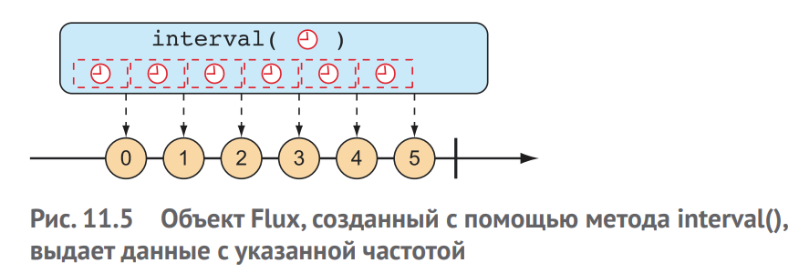
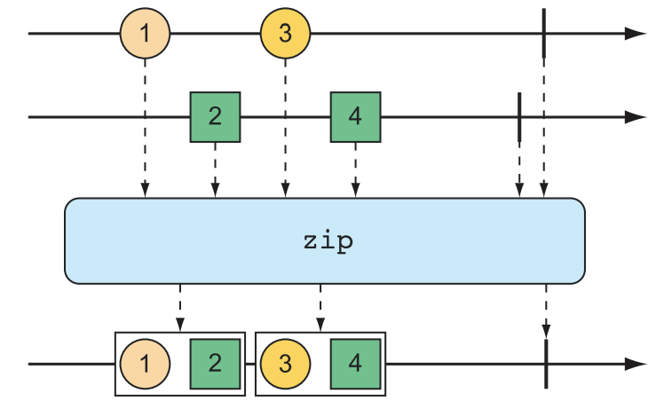
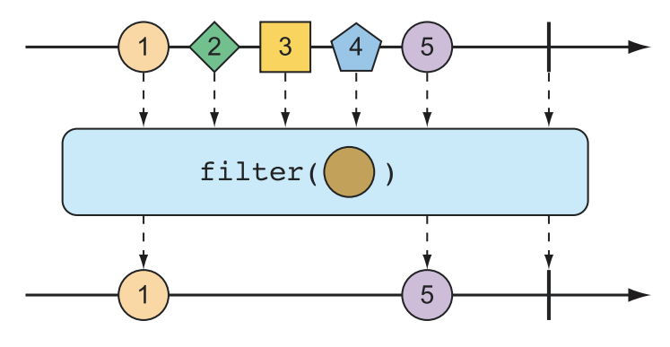
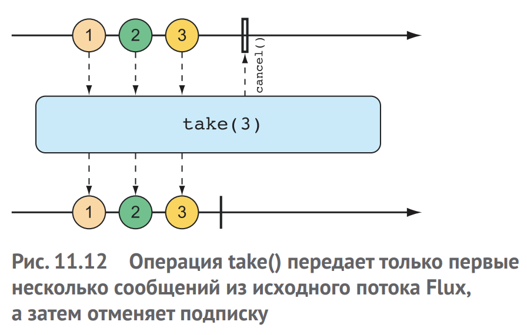
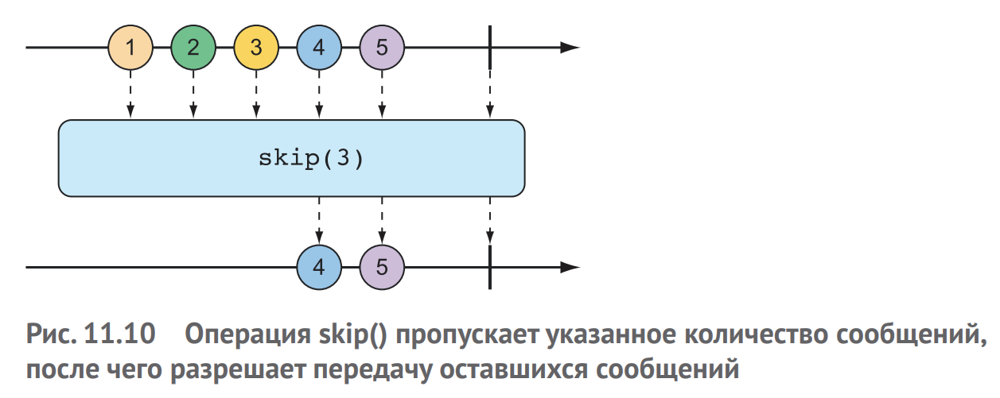
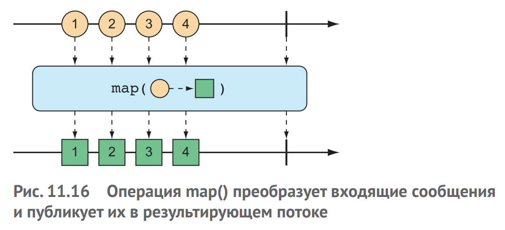
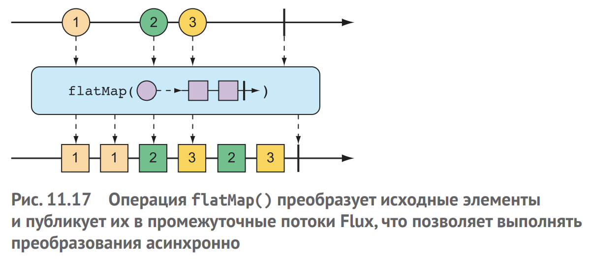
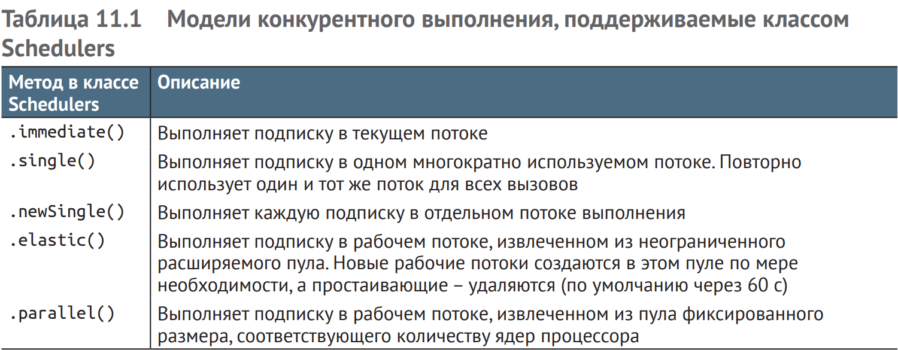

# Reactive Streams

```Reactive Streams```  – это инициатива, запущенная в  конце 2013 года
инженерами из Netflix, Lightbend и  Pivotal (последняя компания
в этом списке как раз и занимается разработкой Spring). Цель Reactive
Streams – поддержка стандарта асинхронной обработки потоков с неблокирующим обратным давлением (backpressure).

Reactive Streams поддерживает асинхронную обработку наборов данных
любого размера, включая бесконечные наборы данных. Обработка данных выполняется в режиме реального времени по мере их поступления
с учетом обратного давления, помогающего не перегружать получателей.

```Обратное давление``` – это средство, помогающее получателям данных избежать перегрузки при работе со
слишком быстрым источником данных; с  его помощью получатели
могут установить ограничение на объем, который они готовы обработать в единицу времени

### Спецификацию Reactive Streams
можно свести к четырем определениям интерфейсов: 
1) Publisher

Издатель Publisher создает данные и отправляет их подписчику
```java
public interface Publisher<T> {
 void subscribe(Subscriber<? super T> subscriber);
}
```
2) Subscriber

После оформления подписки подписчик Subscriber может получать события от издателя. Эти события отправляются через методы
в интерфейсе подписчика Subscriber

```java
public interface Subscriber<T> {
    void onSubscribe(Subscription sub);
    void onNext(T item);
    void onError(Throwable ex);
    void onComplete();
}
```

3) Subscription

Первое событие, которое получит подписчик, – это вызов onSubscribe(). Когда издатель вызывает onSubscribe(), он передает объект
  Subscription подписчику. Именно через Subscription подписчик Subscriber может управлять своей подпиской:

Подписчик Subscriber может вызвать request(), чтобы запросить отправку данных, или cancel(), чтобы отменить подписку. 

При вызове `request()` подписчик передает значение типа long, обозначающее количество элементов данных, которое он готов принять. Именно здесь
возникает `обратное давление`, не позволяющее издателю отправлять больше данных, чем может обработать подписчик. 

После получения запрошенного количества элементов подписчик может снова вызвать `request()` и запросить дополнительные данные.

`onNext()` - После запроса данных подписчиком Subscriber они начинают передаваться через поток. 
Для каждого элемента, опубликованного издателем Publisher, будет вызываться метод `onNext()` для доставки данных подписчику `Subscriber`. 

`onError()` - вызывается в случае появления какой-либо `ошибки`. 

`onComplete()` - вызывается если у издателя Publisher закончились данные и он не собирается производить новые данные
(чтобы сообщить подписчику о завершении работы).
```java
public interface Subscription {
 void request(long n);
 void cancel();
}
```
4) Processor

Представляет комбинацию подписчика Subscriber и издателя Publisher

```java
public interface Processor<T, R>
 extends Subscriber<T>, Publisher<R> {}
```

### Reactor
Пример:
```java
Mono.just("test")
 .map(n -> n.toUpperCase())
 .map(cn -> "Hello, " + cn + "!")
 .subscribe(System.out::println);
```

* ``Mono`` в  этом примере – это один из двух основных типов Reactor.
* ``Flux`` - второй базовый тип.

Оба являются реактивными реализациями 'Publisher'.

`Flux и Mono` предлагают более 500 операций, которые можно условно разделить на следующие категории:
1) создание;
2) комбинирование;
3) преобразование;
4) логика.

### 1. Генерирование новых данных в потоке Flux:

`just` - создание реактивных объектов

```java
public void createByArray() {
    String[] fruitStr = new String[]{"apple", "orange", "banana"};
    
    var fruitFlux = Flux.fromArray(fruitStr);
}
```

```java
Flux<String> list = Flux.just("apple", "orange", "banana");
```

```java
Flux.fromIterable(list);

Flux.fromStream(stream);

Flux.fromArray(arr);
```

`range` - генерация элементов в заданном диапазоне
```java
@GetMapping("range")
public Flux<Integer> rangeExample(){
    return Flux.range(1,5);
}
```
out:
``[1, 2, 3, 4, 5]``

`interval` - выдает данные с указанной частотой 



```java
@GetMapping("interval")
public Flux<?> intervalFluxExample() {
    return Flux
        .interval(Duration.ofSeconds(1))
        .take(5);
}
```
out:
````[0, 1, 2, 3, 4]````

### 2. Комбинирование реактивных типов

`merge` - объединить 2 Flux

```java
@GetMapping("merge")
public Flux<?> mergeTwoFluxExample() {
    var flux1 = Flux.just("one", "two");
    var flux2 = Flux.just("three", "four");

    return flux1.mergeWith(flux2);
}
```
out: 
``
["one","two","three","four"]
``

`zip` - Каждый элемент в  потоке, созданном операцией zip(), является
экземпляром Tuple2 (объектом-контейнером, содержащим два других объекта), содержащим элементы из обоих исходных потоков Flux
в том порядке, в каком они были опубликованы

```java
@GetMapping("zip")
public Flux<?> zipTwoFluxExample() {
    var flux1 = Flux.just("one", "two");
    var flux2 = Flux.just("three", "four");

    return flux1.zipWith(flux2);
}
```

out: 
```
[
    {
        "t1": "one",
        "t2": "three"
    },
    {
        "t1": "two",
        "t2": "four"
    }
]
```



```java
@GetMapping("zip-to-response")
public Flux<?> zipTwoFluxWithCallableExample() {
    var flux1 = Flux.just("Artem", "James");
    var flux2 = Flux.just(34, 21);
    Flux<ResponseDto> result = Flux.zip(flux1, flux2, ResponseDto::new);

    return result;
}

@Getter
@AllArgsConstructor
class ResponseDto {
  private String name;
  private Integer age;
}
```

# Фильтрация реактивных потоков

1. `Filter` - работает аналогично как в Stream API



```java
@GetMapping
public Flux<?> filterExample(){
    Flux<String> res = Flux.just("one", "two", "aaaa");

    return res.filter(s -> s.length() > 3);
}
```
out: `["aaaa"]`

2. `distinct` - пропустит только те элементы из исходного потока, которые еще не были опубликованы

```java
@GetMapping("distinct")
public Flux<?> distinctExample(){
    Flux<String> res = Flux.just("one", "two", "one");

    return res.distinct();
}
```
out: 
```json
[
    "one",
    "two"
]
```
3. `take(N)` - возьмет только первые N сообщений



```java
@GetMapping("take")
public Flux<?> takeExample(){
    Flux<String> res = Flux.just("one", "two", "new");

    return res.take(1);
}
```
out:
```json
[
  "one"
]
```

4. `skip(N)` - пропустит первые N сообщений



```java
@GetMapping("skip")
public Flux<?> skipExample(){
    Flux<String> res = Flux.just("one", "two", "new");

    return res.skip(2);
}
```

out:
```json
[
    "new"
]
```

# Отображение реактивных данных

1. `map()`
2. `flatMap()`

### Map

```java
@GetMapping("map")
public Flux<?> mapExample() {
    return Flux.just("Name Surname", "Agent Smith")
            .map(s -> {
                var arrStr = s.split("\s");

                return new Employee(arrStr[0], arrStr[1]);
            });
}
```
out:
```json
[
    {
        "name": "Name",
        "surname": "Surname"
    },
    {
        "name": "Agent",
        "surname": "Smith"
    }
]
```

Важно помнить, что `map()` выполняет преобразование `синхронно`, 
по мере публикации элементов исходным потоком Flux.

Если преобразование должно выполняться `асинхронно`, то используйте операцию `flatMap()`.

### Flat map

Для успешного применения операции flatMap() требуется некоторая практика. 

Вместо `простого отображения` одного объекта в другой, как в случае с `map()`, операция `flatMap()`
`отображает каждый объект в  новый поток` Mono или Flux. 
Затем получившиеся потоки Mono или Flux объединяются в результирующий поток Flux. 

При использовании вместе с  `subscribeOn()` операция `flatMap()` позволяет в полной мере `раскрыть 
всю асинхронную мощь` типов Reactor



```java
@GetMapping("flat-map")
public Flux<Employee> flatMapExample() {
    return Flux.just("Name Surname", "Agent Smith")
            .flatMap(s -> Mono.just(s)
                    .map(s1 -> {
                        var arrStr = s1.split("\s");
                        return new Employee(arrStr[0], arrStr[1]);
                    })
                    .subscribeOn(Schedulers.parallel())
            );
}
```
### Порядок не гарантируется так как выполняется в параллельных потоках!
out:
```json
[
    {
        "name": "Agent",
        "surname": "Smith"
    },
    {
        "name": "Name",
        "surname": "Surname"
    }
]
```
or
```json
[
    {
        "name": "Name",
        "surname": "Surname"
    },
    {
        "name": "Agent",
        "surname": "Smith"
    }
]
```


1. Обратите внимание, что flatMap() принимает функцию (в этом
примере – лямбда-выражение), которая преобразует входную строку в поток Mono типа String.

2. Затем к потоку Mono применяется операция `map()`, преобразующая строку в объект `'Employee'`. 
3. После преобразования строк в объекты `'Employee'` во всех промежуточных потоках полученные
результаты публикуются в одном общем потоке, который возвращает`flatMap()`.
Если остановиться на этом, то полученный поток будет содержать объекты `'Employee'`, созданные синхронно и в том же порядке, что
и в примере с map(). 

4. Но в нашем примере к потокам Mono применяется еще одна операция – `subscribeOn()`
, чтобы указать, что каждая
подписка должна производиться в параллельном потоке выполнения.
Как следствие операции отображения нескольких входных объектов String могут выполняться `асинхронно и параллельно`.

### subscribeOn()

`subscribe()` – это глагол, означающий «подписаться на реактивный поток» и фактически запускающий его

`subscribeOn()` - является скорее определением, описывающим, как должна осуществляться конкурентная подписка. Reactor
не навязывает какой-то определенной модели конкурентного выполнения; и именно через subscribeOn() можно указать модель, передав
один из статических методов класса `Schedulers`.

`класс Schedulers` поддерживает несколько моделей
конкурентного выполнения, в том числе перечисленные в табл:



Основное преимущество flatMap() и  subscribeOn() заключается
в возможности увеличить пропускную способность потока, распределив работу между несколькими параллельными потоками. 
Но, так как работа выполняется в параллельных потоках, порядок их завершения
не гарантируется, поэтому невозможно заранее предсказать, в каком порядке будут опубликованы элементы в  результирующем потоке. 